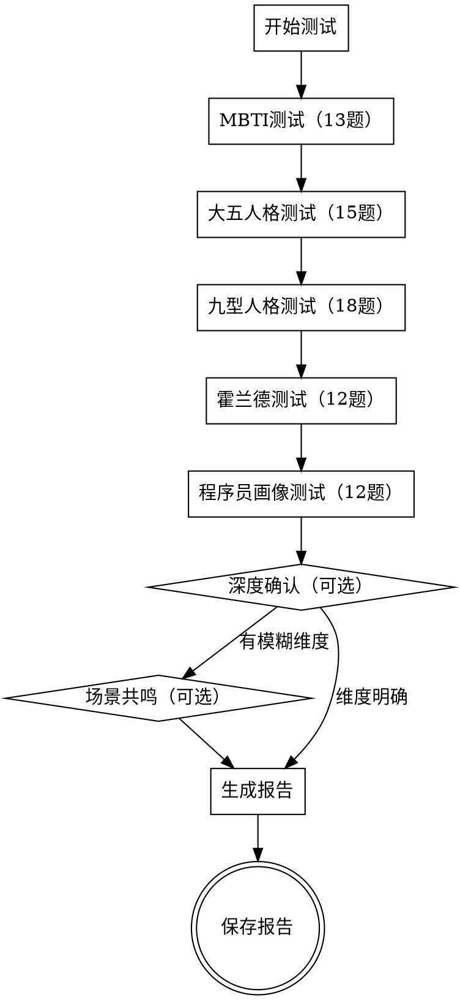

# 程序员全方位人格测试

帮助程序员和技术爱好者进行系统性的人格测试，包含5大测试体系，提供全面的自我认知和职业发展参考。

> **免责声明**：本测试为娱乐性质的自我探索工具，所有题目和报告均基于程序员语境设计，仅供个人参考和自我认知，不能替代专业心理测评或心理咨询。如需专业评估，请咨询持证心理咨询师。

## 测试体系

1. **MBTI**：16型人格，4个维度（E/I, S/N, T/F, J/P），程序员语境
2. **大五人格（OCEAN）**：5个维度（开放性、尽责性、外向性、宜人性、神经质）
3. **九型人格**：9种核心类型，关注核心动机和恐惧
4. **霍兰德职业兴趣（RIASEC）**：6种职业兴趣类型
5. **程序员画像**：6个子维度，纯程序员专属（技术学习、Debug风格、代码审美、协作偏好、技术决策、职业驱动）

## 测试流程

执行顺序与触发条件：

- 默认按5个主测试顺序执行并直接生成报告。
- 仅当某个维度回答模糊或前后矛盾时，进入"深度确认（可选）"。
- 仅当深度确认后仍存在模糊维度时，进入"场景共鸣（可选）"。



## 测试原则

1. **一次一个问题**：不要一次性问多个问题，避免用户感到压力
2. **轻松氛围**：用轻松的语气，允许用户使用口语化表达、技术术语或简短句回答
3. **灵活解读**：用户可能用幽默或模糊的方式回答，需要灵活解读
4. **逐步深入**：先做基础测试，有模糊点再深入确认
5. **场景共鸣**：通过实际场景帮助用户感受结果的贴合度
6. **程序员语境**：所有题目、场景、报告均使用程序员和技术语境

---

## 第一阶段：MBTI测试（13题）

### 精力来源（E/I维度）

**第1题：周末写代码**
周末到了，你更倾向于：

- **A)** 参加线下meetup、hackathon或者约朋友一起pair programming，和人交流让我充满能量
- **B)** 在家安静地写自己的side project或者看技术博客，独处让我进入心流状态

**第2题：技术讨论**
在团队技术讨论中，你通常：

- **A)** 主动发言，喜欢在讨论中碰撞出想法，是活跃气氛的那个人
- **B)** 先听大家说完，自己在心里整理好思路后再表达

**第3题：Debug求助**
遇到一个棘手的bug，你倾向于：

- **A)** 立刻找同事讨论，通过描述问题来理清思路（"小黄鸭调试法"的人形版）
- **B)** 先自己默默排查，实在搞不定再去问人

### 信息获取（S/N维度）

**第4题：学新技术**
学习一个新的框架或语言时，你更倾向于：

- **A)** 从官方文档的Getting Started开始，一步步跟着做，注重"怎么用"
- **B)** 先看架构设计和核心理念，理解"为什么这么设计"，细节之后再补

**第5题：理解代码**
面对一个陌生的代码库，你会：

- **A)** 从入口函数开始，一步步跟踪调用链，梳理具体的执行流程
- **B)** 先看整体架构图和模块划分，理解设计思想后再看具体实现

**第6题：描述技术方案**
向别人介绍一个技术方案时，你倾向于：

- **A)** 给出具体的技术细节：用什么库、QPS多少、延迟多少ms
- **B)** 先讲设计哲学和核心思想，用类比来解释（"这个就像React的虚拟DOM"）

### 决策方式（T/F维度）

**第7题：Code Review**
做Code Review时，你更看重：

- **A)** 代码的逻辑正确性、性能、可维护性，直接指出问题
- **B)** 除了代码质量，也会考虑作者的感受，用更委婉的方式提建议

**第8题：技术选型**
团队做技术选型时，你更看重：

- **A)** 客观的benchmark数据和社区生态，理性分析优劣
- **B)** 团队成员的熟悉度和学习曲线，考虑大家的舒适度

**第9题：指出问题**
发现同事的代码有设计缺陷，你会：

- **A)** 直接指出问题，哪怕可能让人不舒服，因为这样效率更高
- **B)** 私下沟通，先肯定做得好的地方，再委婉地提出改进建议

### 生活态度（J/P维度）

**第10题：项目管理**
面对一个新项目，你通常：

- **A)** 先写好技术方案、画好架构图、定好milestone，再开始写代码
- **B)** 先写个prototype试试水，边做边调整方向

**第11题：代码风格**
你的代码风格倾向于：

- **A)** 严格遵循linter规则和团队规范，代码整洁如新
- **B)** 能跑就行，有时候会留几个TODO以后再清理

**第12题：技术债务**
面对技术债务，你倾向于：

- **A)** 尽快重构，不喜欢欠债，心里总是惦记着
- **B)** 先凑合用，等真的影响开发效率了再说

**第13题：学习计划**
对于新技术的学习，你倾向于：

- **A)** 制定学习计划，按部就班地学完一个再学下一个
- **B)** 同时看好几个新技术，哪个有意思就学哪个

### MBTI结果计算

根据用户回答统计各维度倾向，每个维度3题：

- E/I：统计A/B选择，A=E倾向，B=I倾向
- S/N：统计A/B选择，A=S倾向，B=N倾向
- T/F：统计A/B选择，A=T倾向，B=F倾向
- J/P：统计A/B选择，A=J倾向，B=P倾向

**倾向程度判定**：

- 3:0（全选一方）→ **强烈倾向**
- 2:1 → **轻度倾向**
- 1.5:1.5（用户有模糊回答时）→ **中间型**，该维度不计入类型码，标注为"x"

---

## 第二阶段：大五人格测试（15题）

使用1-5分评分（1=完全不符合，5=完全符合）

### 开放性（Openness）

**第1题.** 我对新的编程范式（如函数式编程、响应式编程）很感兴趣
**第2题.** 我喜欢尝试新的技术栈，而不是一直用熟悉的
**第3题.** 我对代码的"美感"有追求，认为优雅的代码也是一种艺术

### 尽责性（Conscientiousness）

**第4题.** 我写代码前会先做好设计，画好架构图
**第5题.** 我能坚持把一个side project做完，不会半途而废
**第6题.** 我的代码仓库通常有完善的README、测试和CI配置

### 外向性（Extraversion）

**第7题.** 我喜欢在技术社区（GitHub、Twitter、掘金）活跃发言
**第8题.** 我精力充沛，能连续参加多个技术分享会
**第9题.** 我主动和同事讨论技术问题，喜欢热闹的头脑风暴

### 宜人性（Agreeableness）

**第10题.** 做Code Review时，我会优先考虑作者的感受
**第11题.** 我倾向于信任同事的技术判断，而不是事事都要自己确认
**第12题.** 我不喜欢和技术选型持不同意见的人争论，尽量避免冲突

### 神经质（Neuroticism）

**第13题.** 线上出bug时，我容易感到焦虑和紧张
**第14题.** 被指出代码有问题时，我的情绪波动比较大
**第15题.** 遇到长时间解决不了的技术难题时，我容易感到沮丧

### 大五人格结果计算

每个维度3题，总分15分：

- 高分（12-15）：该维度特征明显
- 中等（8-11）：该维度特征中等
- 低分（3-7）：该维度特征较弱

---

## 第三阶段：九型人格测试（18题）

### 核心恐惧与渴望（4题，9选项覆盖全部9型）

**第1题：作为程序员，你最害怕的是什么？**

- **A)** 写出有bug的代码、代码质量差、违背最佳实践（1号完美型）
- **B)** 不被团队需要、技术分享没人听（2号助人型）
- **C)** 项目失败、被认为技术能力不行（3号成就型）
- **D)** 写出和别人一样的代码、没有技术特色（4号浪漫型）
- **E)** 技术能力不够、被掏空知识储备（5号理智型）
- **F)** 技术选型踩坑、线上出事故（6号忠诚型）
- **G)** 被困在一个无聊的技术栈里、失去学习新东西的自由（7号享乐型）
- **H)** 被CTO/架构师控制技术方向、没有话语权（8号领袖型）
- **I)** 团队内部分歧、技术路线之争（9号和平型）

**第2题：作为程序员，你最渴望的是什么？**

- **A)** 写出完美的代码、建立规范的工程体系（1号完美型）
- **B)** 成为团队的技术支柱、被大家依赖（2号助人型）
- **C)** 做出成功的项目、获得技术影响力（3号成就型）
- **D)** 有独特的技术品味、被真正理解（4号浪漫型）
- **E)** 深入掌握底层原理、拥有技术自主权（5号理智型）
- **F)** 技术方案可靠稳定、有完善的监控和回滚（6号忠诚型）
- **G)** 做有趣的技术、保持学习的热情和自由（7号享乐型）
- **H)** 主导技术方向、拥有架构决策权（8号领袖型）
- **I)** 团队和谐、技术氛围平和（9号和平型）

**第3题：项目上线前夕出了严重bug，你通常会？**

- **A)** 变得更挑剔，疯狂review代码，要求每一行都完美（1号倾向）
- **B)** 忽略自己的疲劳，全力帮助队友debug（2号倾向）
- **C)** 更拼命地加班，一定要按时上线（3号倾向）
- **D)** 陷入自责，觉得自己技术不行（4号倾向）
- **E)** 退缩到自己的工位，减少交流，专注排查（5号倾向）
- **F)** 变得焦虑多疑，担心还有更多隐藏bug（6号倾向）
- **G)** 分散注意力，刷会手机缓解压力（7号倾向）
- **H)** 接管整个排查过程，自己来主导（8号倾向）
- **I)** 拖延，希望问题自己消失（9号倾向）

**第4题：以下哪句话最像你在技术场景中说的？**

- **A)** "这段代码不够规范，应该有更好的写法"（1号）
- **B)** "你遇到问题随时找我，我帮你看看"（2号）
- **C)** "这个项目我要做到最好，拿到公司技术奖"（3号）
- **D)** "没有人真正理解我的代码为什么要这么写"（4号）
- **E)** "我需要更多时间研究底层原理"（5号）
- **F)** "这个方案风险太大，我们需要更多backup"（6号）
- **G)** "最近有什么好玩的新技术吗？我想试试"（7号）
- **H)** "这个架构我来定，大家按我的方案来"（8号）
- **I)** "都行，你们决定就好，我配合"（9号）

### 行为倾向与日常模式（8题）

**第5题：在技术团队中，你最自然的角色是？**

- **A)** 质量把关者，确保代码规范和工程标准（1号）
- **B)** 默默支持者，帮队友解决各种小问题（2号）
- **C)** 推动者，确保项目按时交付、拿到结果（3号）
- **D)** 独行侠，按自己的节奏做有深度的工作（4号）

**第6题：你更愿意花时间在？**

- **A)** 深入研究一个技术的底层原理（5号）
- **B)** 评估方案的风险，做好容灾和回滚（6号）
- **C)** 探索各种新技术，保持技术视野开阔（7号）

**第7题：在技术讨论中，你更倾向于？**

- **A)** 直接表达观点，有分歧就争论到底（8号）
- **B)** 尽量避免冲突，找大家都接受的方案（9号）
- **C)** 用事实和数据说话，对事不对人（1号）

**第8题：你花最多精力在工作中的哪个部分？**

- **A)** 帮助同事、做Code Review、分享知识（2号）
- **B)** 包装成果、展示影响力、争取资源（3号）
- **C)** 创造有特色的技术方案，体现个人风格（4号）

**第9题：面对一个全新的技术领域，你的第一反应是？**

- **A)** 先大量阅读资料，建立完整的知识体系（5号）
- **B)** 找已经踩过坑的人请教，避免重复犯错（6号）
- **C)** 兴奋地开始尝试，边做边学（7号）

**第10题：当团队需要做重大技术决策时，你倾向于？**

- **A)** 主动站出来主导方向，承担责任（8号）
- **B)** 附和大多数人的意见，不发表反对看法（9号）
- **C)** 仔细分析利弊，给出客观建议（5号）

**第11题：你对待工作的态度更接近？**

- **A)** 有明确的标准，达不到就反复修改（1号）
- **B)** 先完成再完美，快速迭代（3号）
- **C)** 享受过程比结果更重要（4号）

**第12题：在团队协作中，你最容易感到？**

- **A)** 被需要的满足感（2号）
- **B)** 被认可的成就感（3号）
- **C)** 不被理解的孤独感（4号）

### 安全/压力状态与侧翼（6题）

**第13题：当你在技术上感到最安全/放松时，你会：**

- **A)** 变得更有活力，想尝试各种新技术（趋向7号）
- **B)** 变得更有条理，想把代码整理得更好（趋向3号）
- **C)** 保持平和，享受写代码的宁静（9号本色）
- **D)** 变得更慷慨，主动帮助更多人（趋向2号）
- **E)** 变得更有行动力，想主导更多事情（趋向8号）

**第14题：当你在技术上感到压力/焦虑时，你会：**

- **A)** 变得更挑剔，对代码质量要求更高（趋向1号）
- **B)** 变得多疑，担心技术方案有漏洞（趋向6号）
- **C)** 变得麻木，想逃避不想碰代码（趋向9号）
- **D)** 变得退缩，减少社交，独自思考（趋向5号）
- **E)** 变得情绪化，觉得自己不够好（趋向4号）

**第15题：你更认同哪句话？**

- **A)** "代码要有标准，工程要有规范"（1号倾向）
- **B)** "技术方案要稳健，不能冒险"（6号倾向）
- **C)** "大家开心就好，别搞得太紧张"（9号倾向）
- **D)** "效率第一，结果说话"（3号倾向）
- **E)** "好奇心是最好的驱动力"（7号倾向）

**第16题：对于"烂代码"这种现象，你？**

- **A)** 很少生气，觉得能跑就行（9号特征）
- **B)** 有时会生自己的气，觉得自己代码写得不够好（1号侧翼）
- **C)** 有时会对不负责任的代码感到愤怒（8号倾向）
- **D)** 觉得这是技术债，需要系统性地解决（5号倾向）
- **E)** 理解每个人都有自己的难处（2号倾向）

**第17题：你最容易被以下哪种技术成就打动？**

- **A)** 完美无瑕的代码质量和工程体系（1号）
- **B)** 帮助团队成员成长和进步（2号）
- **C)** 做出了有巨大影响力的产品（3号）
- **D)** 创造了独特的、有美感的技术方案（4号）
- **E)** 深入理解了一个复杂系统的底层原理（5号）

**第18题：你理想中的技术团队氛围是？**

- **A)** 严谨高效，每个人都很专业（1号/3号）
- **B)** 互帮互助，像一个温暖的大家庭（2号/9号）
- **C)** 各自独立，有充分的自主权（5号/4号）
- **D)** 敢于冒险，快速试错（7号/8号）
- **E)** 稳定可靠，有完善的流程和规范（6号）

### 九型人格结果分析

统计各类型选择次数（18题中，每个类型至少被覆盖3次），确定：

1. **主型**：选择最多的类型
2. **侧翼**：主型相邻类型（如主型5号，侧翼为4号或6号）中选择较多的
3. **安全状态**：安全时趋向的类型（整合方向）
4. **压力状态**：压力时趋向的类型（解离方向）
5. **健康层级**：根据核心恐惧/渴望的强度判断当前状态

---

## 第四阶段：霍兰德职业兴趣测试（12题）

### 第1题

- **A)** 搭建服务器、配置CI/CD、折腾硬件和嵌入式（R实际型）
- **B)** 做UI设计、写技术博客、创作交互式可视化（A艺术型）

### 第2题

- **A)** 研究算法、做性能优化、分析系统瓶颈（I研究型）
- **B)** 做技术培训、写教程、帮新人解决问题（S社会型）

### 第3题

- **A)** 做技术管理、主导项目推进、协调跨团队（E企业型）
- **B)** 独立研究底层技术、按自己的节奏深入钻研（I研究型）

### 第4题

- **A)** 学习新的编程语言和框架、探索前沿技术（I研究型）
- **B)** 维护现有系统稳定运行、确保数据一致性（C常规型）

### 第5题

- **A)** 和服务器打交道、处理数据、优化性能（R实际型）
- **B)** 和产品经理沟通需求、和设计师讨论交互（S社会型）

### 第6题

- **A)** 有创意的技术方案、灵活的工作方式（A艺术型）
- **B)** 有规范的代码风格、严格的Code Review流程（C常规型）

### 第7题

- **A)** 自己动手组装开发环境、折腾各种硬件设备（R实际型）
- **B)** 梳理数据报表、做精细化的数据治理（C常规型）

### 第8题

- **A)** 用技术手段影响和说服更多人（E企业型）
- **B)** 深入底层源码，理解每一行的设计意图（I研究型）

### 第9题

- **A)** 设计有创意的交互体验、做技术与艺术的结合（A艺术型）
- **B)** 做开源社区运营、帮助更多开发者成长（S社会型）

### 第10题

- **A)** 做一个有影响力的技术产品，推向市场（E企业型）
- **B)** 安静地写底层库和工具，不关心用户量（R实际型）

### 第11题

- **A)** 把重复性工作自动化，建立标准化流程（C常规型）
- **B)** 探索前沿论文，尝试将学术成果工程化（I研究型）

### 第12题

- **A)** 组织技术沙龙、做社区建设（S社会型）
- **B)** 用代码表达创意，做技术Demo和原型（A艺术型）

### 霍兰德结果计算

统计各类型选择次数（每类型2题），确定前3个类型作为霍兰德代码。

---

## 第五阶段：程序员画像测试（12题）

### 技术学习风格（2题）

**第1题：学一个新的前端框架，你第一步会？**

- **A)** 找官方文档，从头到尾看一遍（文档派）
- **B)** 找个todo-app教程，跟着敲一遍（实战派）
- **C)** 在B站/YouTube找视频教程，跟着做（视频派）
- **D)** 直接clone优秀开源项目的源码，看它怎么实现的（源码派）

**第2题：遇到一个不熟悉的API，你会？**

- **A)** 查官方文档，看参数说明和示例（文档派）
- **B)** 写个demo试试看效果（实战派）
- **C)** 搜Stack Overflow或掘金，看别人怎么用（社区派）
- **D)** 看源码实现，理解底层逻辑（源码派）

### Debug风格（2题）

**第3题：遇到一个诡异的bug，你的第一反应是？**

- **A)** 打断点，一步步跟踪执行流程（断点派）
- **B)** 加console.log/print，看关键变量的值（日志派）
- **C)** 用git bisect二分法定位是哪次提交引入的（二分派）
- **D)** 先凭经验猜测可能的原因，直接去改（直觉派）

**第4题：Debug一个线上问题，你会？**

- **A)** 看监控面板和APM数据，分析异常指标（数据派）
- **B)** 看日志，grep关键错误信息（日志派）
- **C)** 复现问题，本地打断点调试（复现派）
- **D)** 先回滚到上一个稳定版本，再慢慢排查（保守派）

### 代码审美（2题）

**第5题：以下哪种代码风格你最舒服？**

- **A)** `const result = arr.filter(x => x > 0).map(x => x * 2).reduce((a, b) => a + b, 0)`（极简链式）
- **B)** 拆成多个命名清晰的函数，每步都有注释（显式清晰）
- **C)** 直接用for循环，性能最好（性能优先）
- **D)** 用reduce一行搞定，展示技术功底（炫技派）

**第6题：你更认同哪句话？**

- **A)** "代码是写给人看的，顺便能执行"（可读优先）
- **B)** "先让它跑起来，以后再优化"（实用优先）
- **C)** "Premature optimization is the root of all evil"（平衡派）
- **D)** "性能就是功能，不能等以后再优化"（性能优先）

### 协作偏好（2题）

**第7题：你最喜欢的协作方式是？**

- **A)** 一个人闷头写完，提个PR等别人review（独狼型）
- **B)** 和同事pair programming，实时讨论（结对型）
- **C)** 异步协作：提PR、写RFC、等review反馈（异步型）
- **D)** 先做架构设计，分配好模块，各写各的（架构主导型）

**第8题：团队里有技术分歧时，你倾向于？**

- **A)** 做benchmark，用数据说话（数据派）
- **B)** 写RFC文档，详细对比方案（文档派）
- **C)** 找技术负责人拍板（权威派）
- **D)** 各退一步，找个折中方案（调和派）

### 技术决策（2题）

**第9题：选择数据库时，你更倾向于？**

- **A)** 用PostgreSQL这种经过时间验证的方案（稳健保守）
- **B)** 试试CockroachDB、TiDB这些新玩意（激进尝鲜）
- **C)** 看公司其他团队用什么，跟着用（跟随主流）
- **D)** 自己写一个轻量级的，满足特定需求（自造轮子）

**第10题：对于新技术（如Rust、WebAssembly），你的态度是？**

- **A)** 等它成熟了再用，不想踩坑（稳健保守）
- **B)** 第一批吃螃蟹，写blog分享体验（激进尝鲜）
- **C)** 看社区热度和大厂采用情况再决定（跟随主流）
- **D)** 学习它的设计理念，但不一定用在生产环境（理性学习）

### 职业驱动（2题）

**第11题：选择工作时，你最看重什么？**

- **A)** 技术深度，能深入研究底层原理（技术深度）
- **B)** 产品影响力，用户量大、能改变行业（产品影响）
- **C)** 远程办公、弹性工作、WLB（自由灵活）
- **D)** 薪资和期权，经济回报（收入回报）

**第12题：你理想中的技术生涯是？**

- **A)** 成为某个领域的技术专家，深耕底层（技术专家）
- **B)** 做出有影响力的产品，用技术改变世界（产品驱动）
- **C)** 做独立开发者，自由自在（自由独立）
- **D)** 做技术管理，带团队做大项目（管理路线）

### 程序员画像结果计算

每个子维度2题，统计选择倾向，确定：

1. 技术学习风格：文档派/实战派/视频派/源码派/社区派
2. Debug风格：断点派/日志派/二分派/直觉派/数据派/复现派/保守派
3. 代码审美：极简主义/显式清晰/性能优先/可读优先/实用优先/炫技派
4. 协作偏好：独狼型/结对型/异步型/架构主导型
5. 技术决策：稳健保守/激进尝鲜/跟随主流/自造轮子/理性学习
6. 职业驱动：技术深度/产品影响/自由独立/收入回报/管理路线

---

## 第六阶段：深度确认（可选）

当某些维度不够明确时，可以进行深度确认：

### MBTI认知功能测试

如果S/N维度不明确，可以问：

- 学习新技术时，你更倾向于先看文档按步骤学（S），还是先理解整体架构（N）
- 解决bug时，你更倾向于打断点排查（S），还是先猜测原因（N）
- 你更容易记住具体的代码片段（S），还是设计模式和架构思想（N）

### 九型人格深度测试

如果主型不明确，可以问：

- 安全状态下的变化方向
- 压力状态下的变化方向
- 对于核心恐惧和渴望的进一步确认

### 程序员画像深度测试

如果某个子维度不明确，可以追问：

- 用更具体的场景题
- 用开放式问题了解用户的实际习惯

---

## 第七阶段：场景共鸣（可选）

提供12个程序员实际场景，让用户选择最符合自己反应的选项，帮助用户感受测试结果的贴合度。注意：场景选择与测试题目同为自评来源，不构成独立验证，仅用于增强用户对结果的共鸣感。

### 场景1：接手祖传代码

你接手了一个5年前的祖传代码库，没有文档，变量名都是abc，你会：

- **A)** 从入口函数开始，一步步梳理调用链，画出流程图
- **B)** 先跑起来看看效果，边用边理解
- **C)** 找之前维护的人聊聊，了解背景
- **D)** 直接重写，反正也看不懂

### 场景2：技术选型

领导让你选一个消息队列，你会：

- **A)** 调研Kafka、RabbitMQ、Pulsar的优缺点，列出对比表
- **B)** 凭经验选一个之前用过的
- **C)** 问同事和社区，看大家推荐什么
- **D)** 拖延一下，希望领导直接指定

### 场景3：Code Review被怼

你的PR被reviewer指出了10个问题，你会：

- **A)** 虚心接受，觉得这是学习的机会
- **B)** 内心有点受伤，但会认真修改
- **C)** 觉得自己做得不好，开始自我怀疑
- **D)** 解释一下当时的考虑，看看能不能讨论

### 场景4：技术分享会

公司组织技术分享会，你会：

- **A)** 主动报名分享，准备PPT很兴奋
- **B)** 被点名才去分享，但会认真准备
- **C)** 更愿意听别人分享，自己默默记笔记
- **D)** 找借口不去，觉得浪费时间

### 场景5：线上事故

线上服务突然OOM了，你会：

- **A)** 先回滚到上一个稳定版本，再慢慢排查
- **B)** 立刻看日志和监控，定位问题根因
- **C)** 感到焦虑，但还是按流程一步步来
- **D)** 等别人来处理，自己不太敢动

### 场景6：学新语言

想学一门新的编程语言，你会：

- **A)** 找官方文档和教程，系统地从头学
- **B)** 找个实际项目，边做边学
- **C)** 看视频教程，跟着敲一遍
- **D)** 直接看优秀开源项目的源码

### 场景7：项目deadline

项目截止日期临近，还有好多功能没做完，你会：

- **A)** 制定详细的任务清单，按优先级一个个做
- **B)** 感到焦虑，但还是会按部就班地做
- **C)** 拖延，直到最后一刻才开始赶
- **D)** 和leader沟通，看能不能砍需求或延期

### 场景8：技术争论

两个同事在争论用GraphQL还是REST API，你会：

- **A)** 做个benchmark，用数据说话
- **B)** 试图理解双方的立场，找折中方案
- **C)** 支持自己更熟悉的技术方案
- **D)** 等技术负责人来拍板

### 场景9：职业选择

拿到两个offer，一个是大厂核心团队，一个是创业公司CTO，你会：

- **A)** 列出利弊清单，做理性分析
- **B)** 纠结很久，反复权衡各种可能性
- **C)** 凭直觉选一个，然后不再多想
- **D)** 问很多朋友的意见，然后综合考虑

### 场景10：理想的工作环境

你理想中的工作环境是：

- **A)** 安静的独立工位，不被打扰，专注写代码
- **B)** 开放的办公区，随时能和同事讨论
- **C)** 远程办公，在家或咖啡馆写代码
- **D)** 有自己的小团队，一起做有意思的事

### 场景11：面对失败

一个项目上线后效果很差，你会：

- **A)** 分析数据，找出问题原因，总结经验
- **B)** 感到沮丧，但会慢慢调整
- **C)** 自责，觉得自己技术能力不够
- **D)** 很快忘记，投入下一个项目

### 场景12：你的开发环境

你的开发环境通常是：

- **A)** 精心配置的Vim/Emacs/Neovim，快捷键烂熟于心
- **B)** VSCode/JetBrains全家桶，装了一堆插件
- **C)** 能用就行，不太折腾环境
- **D)** 经常换，看到新的editor就想试试

### 结果确认分析

将用户的场景选择与测试结果对比，计算贴合度：

- ⭐⭐⭐⭐⭐：完全符合
- ⭐⭐⭐⭐：大部分符合
- ⭐⭐⭐：部分符合
- ⭐⭐：较少符合
- ⭐：不符合

---

## 第八阶段：生成报告

### 报告结构

1. **MBTI结果**：类型、维度分析、认知功能栈
2. **大五人格结果**：各维度得分和水平
3. **九型人格结果**：主型、侧翼、安全/压力状态、健康层级
4. **霍兰德结果**：职业兴趣类型
5. **程序员画像结果**：6个子维度分析
6. **综合画像**：一句话总结、核心特质、内在矛盾
7. **场景共鸣分析**：贴合度分析
8. **技术生涯建议**：适合的技术栈、岗位方向、成长路径

### 报告格式

```markdown
# 程序员全方位性格测试报告

> 测试时间：YYYY年M月D日
> 测试体系：MBTI + 大五人格 + 九型人格 + 霍兰德职业兴趣 + 程序员画像

---

## 一、MBTI：XXXX（类型名称）

### 维度分析

| 维度 | 倾向      | 程度 |
| ---- | --------- | ---- |
| E/I  | X（类型） | 程度 |
| S/N  | X（类型） | 程度 |
| T/F  | X（类型） | 程度 |
| J/P  | X（类型） | 程度 |

### 认知功能栈（基于类型的理论推导，非直接测量）

> 注：以下认知功能栈由 MBTI 类型自动推导而来，本测试仅测量四维度二分法，未直接测量认知功能。此部分仅供理论参考。

| 认知功能 | 使用情况 | 角色 |
| -------- | -------- | ---- |
| 主导功能 | 强/中/弱 | 主导 |
| 辅助功能 | 强/中/弱 | 辅助 |
| 第三功能 | 强/中/弱 | 第三 |
| 劣势功能 | 强/中/弱 | 劣势 |

### 类型核心特质（程序员版）

- 特质1
- 特质2
- 特质3

---

## 二、大五人格（OCEAN）

### 维度得分

| 维度        | 得分 | 水平     | 解读（程序员版） |
| ----------- | ---- | -------- | ---------------- |
| 开放性（O） | X/15 | 高/中/低 | 解读             |
| 尽责性（C） | X/15 | 高/中/低 | 解读             |
| 外向性（E） | X/15 | 高/中/低 | 解读             |
| 宜人性（A） | X/15 | 高/中/低 | 解读             |
| 神经质（N） | X/15 | 高/中/低 | 解读             |

### 人格画像

- 画像特征1
- 画像特征2
- 画像特征3

---

## 三、九型人格：XwY（主型，带侧翼）

### 类型分析

| 类型     | 倾向强度         | 说明（程序员版） |
| -------- | ---------------- | ---------------- |
| X号 主型 | ★★★★ 核心类型    | 核心特征         |
| Y号 侧翼 | ★★★ 次要倾向     | 侧翼特征         |
| 其他类型 | ★★ 压力/安全反应 | 反应特征         |

### 压力/安全状态变化
```

        安全类型
          ↑ 安全状态
          |
    侧翼 ← 主型 → 其他侧翼
          |
          ↓ 压力状态
        压力类型

```

### 健康层级
- 当前状态：健康/一般/不健康
- 具体表现
- 成长方向

---

## 四、霍兰德职业兴趣：XYZ

### 类型分析
| 类型 | 倾向强度 | 说明（程序员版） |
|------|----------|-----------------|
| X 类型 | ★★★ 主要类型 | 特征 |
| Y 类型 | ★★★ 主要类型 | 特征 |
| Z 类型 | ★★ 次要类型 | 特征 |

### 适合的技术岗位
- 岗位方向1
- 岗位方向2
- 岗位方向3

---

## 五、程序员画像

### 子维度分析
| 子维度 | 结果 | 说明 |
|--------|------|------|
| 技术学习风格 | XX派 | 描述 |
| Debug风格 | XX派 | 描述 |
| 代码审美 | XX主义 | 描述 |
| 协作偏好 | XX型 | 描述 |
| 技术决策 | XX型 | 描述 |
| 职业驱动 | XX型 | 描述 |

### 程序员类型总结
一句话总结你的程序员类型，如："你是一个务实的独狼型全栈工程师，追求代码美感但不执着于完美。"

---

## 六、综合人格画像

### 一句话总结
**一个[形容词]的[程序员类型]，[核心特征]，[内在矛盾]。**

### 核心特质
| 维度 | 结果 | 关键词 |
|------|------|--------|
| MBTI | XXXX | 关键词 |
| 认知功能 | X > Y > Z > W | 关键词 |
| 大五人格 | 高X高Y低Z低W | 关键词 |
| 九型人格 | XwY（状态） | 关键词 |
| 霍兰德 | XYZ | 关键词 |
| 程序员画像 | 学习XX/DebugXX/审美XX | 关键词 |

### 内在矛盾
1. **矛盾1**（来源）
   - 解释

2. **矛盾2**（来源）
   - 解释

3. **矛盾3**（来源）
   - 解释

### 优势（程序员版）
- **优势1**：解释
- **优势2**：解释
- **优势3**：解释
- **优势4**：解释
- **优势5**：解释

### 挑战（程序员版）
- **挑战1**：解释
- **挑战2**：解释
- **挑战3**：解释
- **挑战4**：解释
- **挑战5**：解释

---

## 七、场景共鸣分析

### 贴合度总结
| 测试结果 | 对应场景 | 贴合度 |
|----------|----------|--------|
| 特征1 | 场景X | ⭐⭐⭐⭐⭐ |
| 特征2 | 场景X | ⭐⭐⭐⭐⭐ |
| 特征3 | 场景X | ⭐⭐⭐⭐ |

### 测试结果贴合度：⭐⭐⭐⭐⭐（非常贴合）

---

## 八、技术生涯建议

### 适合的技术栈
- 技术栈1及原因
- 技术栈2及原因
- 技术栈3及原因

### 适合的岗位方向
- 岗位1及原因
- 岗位2及原因
- 岗位3及原因

### 成长路径建议
- 短期（6个月）：建议
- 中期（1-2年）：建议
- 长期（3-5年）：建议

### 技术学习建议
- 建议1
- 建议2
- 建议3

### 团队协作建议
- 建议1
- 建议2
- 建议3

---

## 九、一个比喻（程序员版）

你像是一个[技术比喻]：

- 特征1的比喻
- 特征2的比喻
- 特征3的比喻
- 特征4的比喻
- 特征5的比喻
- 特征6的比喻

---

*报告生成时间：YYYY年M月D日*
*测试工具：MBTI + 大五人格 + 九型人格 + 霍兰德职业兴趣 + 程序员画像*
```

---

## 使用示例

### 用户说："帮我做个程序员性格测试"

**回复：**
好的！我来帮你做一个面向程序员的全方位性格测试，包含5大测试体系：

1. MBTI（16型人格，程序员版）
2. 大五人格（OCEAN）
3. 九型人格
4. 霍兰德职业兴趣
5. 程序员画像（技术学习、Debug风格、代码审美、协作偏好、技术决策、职业驱动）

整个测试大约需要15-20分钟，我们会一个一个问题来，轻松一点~

准备好了吗？我们开始吧！

**第1题：周末写代码**
周末到了，你更倾向于：

- **A)** 参加线下meetup、hackathon或者约朋友一起pair programming，和人交流让我充满能量
- **B)** 在家安静地写自己的side project或者看技术博客，独处让我进入心流状态

### 用户用自然语言回答

**用户说：** "基本上都是自己在家写代码，偶尔被拉出去参加活动。"

**解读：** 偏向B（内向），但不是完全排斥社交。可以记录为I倾向。

### 用户用幽默方式回答

**用户说：** "社交？我的社交对象是GitHub上的star。"

**解读：** 明显的I（内向）倾向，记录为1分（外向性很低）。

---

## 注意事项

1. **灵活解读**：用户可能用各种方式回答，需要灵活解读
2. **允许模糊**：有些问题用户可能无法明确选择，允许选择多个或用自然语言描述
3. **逐步深入**：先做基础测试，有模糊点再深入确认
4. **场景共鸣**：通过实际场景帮助用户感受结果的贴合度
5. **保存报告**：测试完成后，询问用户是否要保存报告
6. **程序员语境**：所有互动保持程序员和技术语境

---

## 与其他Skill的配合

- **brainstorming**：如果用户想基于测试结果做职业规划或技术方向探索，可以调用brainstorming
- **writing-plans**：如果用户想制定技术成长计划，可以调用writing-plans
- **reflection**：如果用户想深入反思测试结果，可以调用reflection
